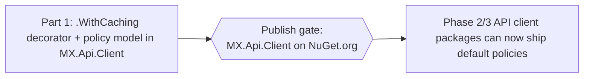

# Phase 1 — Client Caching Capability (Executable Plan)

The **enabling capability** for every API-caching phase: the `.WithCaching(...)` fluent decorator and the defaults-plus-overrides policy model in **`MX.Api.Client`** (`api-client-abstractions`), consuming the Phase 0 `MX.Caching` packages. No API ships default policies and no consumer caches until this is published.

> Read first: [spec.md → MX.Caching facade](../portal-caching-spec/spec.md#mxcaching-facade-over-hybridcache) and [Library defaults + consumer overrides](../portal-caching-spec/spec.md#library-defaults--consumer-overrides).

## What Phase 1 delivers

A single-repo capability in `api-client-abstractions`:
- `.WithCaching(cache => ...)` on the fluent options builder, with **library defaults + consumer overrides + config-bound TTLs** and the precedence `config → override → default → uncached` (incl. the `NotCached` guard).
- A **transparent decorator** over typed feature interfaces (`IGameServersApi`, `IQueryApi`, …) translating a method call into `IMxCache.GetOrCreateAsync` with the resolved policy — no call-site change in consumers.
- **Envelope-awareness** (cache only success / `NotFound`; never `5xx`) and hit/miss **metrics**.

## Resolved decisions (locked)

| #   | Decision   | Choice                                                                                                    |
| --- | ---------- | --------------------------------------------------------------------------------------------------------- |
| 1   | Location   | `MX.Api.Client` in `api-client-abstractions` (the shared client framework every typed client builds on).  |
| 2   | Primitive  | Delegates to `MX.Caching` `IMxCache` (HybridCache-backed); does **not** re-implement caching.             |
| 3   | Decoration | Transparent proxy over the typed feature interfaces — opt-in per method by policy, GET-shaped reads only. |
| 4   | Selection  | Backend is config-driven in `MX.Caching`; `.WithCaching` only selects **tier + TTL + tags** per policy.   |

## Golden rules for the executing agent

- Git hands-off; no secrets/GUIDs; follow `AGENTS.md`; build + test + `dotnet format --verify-no-changes` before any step is done.
- **Publish gate:** finish Part 1, publish `MX.Api.Client`, then API phases consume it. No cross-repo project references.
- Depend on `MX.Caching.Abstractions` interfaces, never a concrete store.

## Definition of done

- `.WithCaching(...)` + policy resolver shipped in `MX.Api.Client`, consuming `MX.Caching`.
- Transparent decorator caches a typed interface method with no call-site change; precedence + `NotCached` + envelope-awareness covered by tests.
- New `MX.Api.Client` published to NuGet.org and restorable.

## Documents

| Doc                                                      | Purpose                                                                                                     |
| -------------------------------------------------------- | ----------------------------------------------------------------------------------------------------------- |
| [part-1-client-decorator.md](part-1-client-decorator.md) | Implement `.WithCaching(...)`, the policy resolver, the transparent decorator, metrics, tests, and publish. |

## Next

[Phase 2 — Repository API caching](../portal-caching-phase-2/README.md) ships default policies in the Repository client + server-side cache-aside, then rolls out to consumers.
