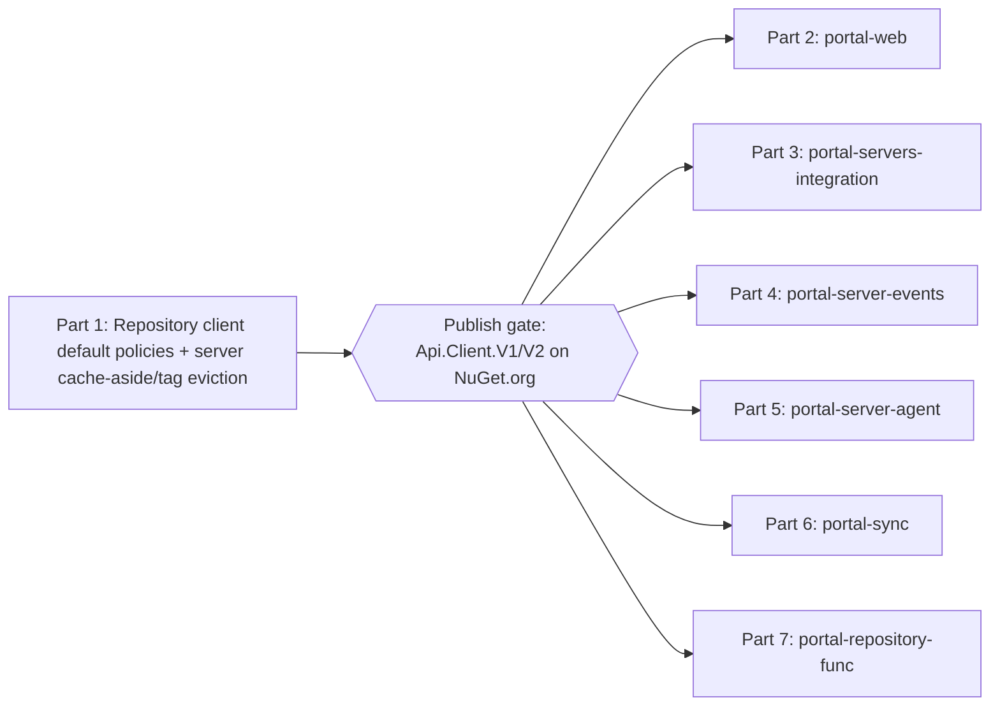

# Phase 2 — Repository API Caching (Executable Plan)

Caching for the **Repository API** — the estate's central data hub, consumed by six services. **Part 1 implements caching in the API** (default policies in its client packages + the API's own server-side cache-aside/tag eviction). **Parts 2–7 roll it out to every consumer.**

> Read first: [Phase 1 — Client caching capability](../portal-caching-phase-1/README.md) (must be published) and [spec.md → L2 use cases](../portal-caching-spec/spec.md#l2-distributed-store--use-cases--data-structures).

## Structure

## What Phase 2 delivers

- **In the API (Part 1):**
  - Provision **one shared cache storage account** (`portal-core`) with RBAC for the **Repository API** identity, and **move LiveStatus (status + players) onto it**.
  - `Api.Client.V1/V2` ship **default cache policies** (`GetGameServer`, `GetGameServers`, `GetMap`/`GetMaps` reference reads cached; mutations `NotCached`) and the **extended connected-players endpoint** (server-side search/sort, Q7).
  - The Repository API host gains **server-side cache-aside** (via a service/repository decorator on `MX.Caching`, shared cache account) for `GetGameServer` (FC-6), dashboard aggregations (FC-8), and per-server settings resolution (FC-9), with **tag eviction** in the mutation handlers and `no-store` on `/info` + `/health/*`.
- **In every consumer (Parts 2–7):** adopt the published client version, opt into library defaults, apply local overrides, retire ad-hoc `IMemoryCache` blocks, and add batching / server-paging where relevant.

## Consumers (rollout order)

| Part                                      | Consumer                     | Highlights                                                                          |
| ----------------------------------------- | ---------------------------- | ----------------------------------------------------------------------------------- |
| [2](part-2-portal-web.md)                 | `portal-web`                 | Biggest consumer; FC-7 batch N+1 loops; retire ad-hoc caches; batch `GetGameServer` |
| [3](part-3-portal-servers-integration.md) | `portal-servers-integration` | Cache `GetGameServer` per query request                                             |
| [4](part-4-portal-server-events.md)       | `portal-server-events`       | Adopt client defaults (no player-id L2 — mutable tags; see Part 4)                  |
| [5](part-5-portal-server-agent.md)        | `portal-server-agent`        | Benefits from server-side settings cache; adopt client defaults                     |
| [6](part-6-portal-sync.md)                | `portal-sync`                | FC-7 batch `GetMap` in `MapRotationActivities`                                      |
| [7](part-7-portal-repository-func.md)     | `portal-repository-func`     | Minimal; adopt defaults for maintenance reads                                       |

## Golden rules

- Git hands-off; no secrets; follow each repo's `AGENTS.md`; build + test + `dotnet format --verify-no-changes` per step.
- **Publish gate:** finish Part 1, publish `Api.Client.V1/V2`, then consumers adopt the published version. No cross-repo project references.
- Auth-scoped reads (user profile/claims) stay **uncached** at any shared tier. `/info` + `/health/*` are `no-store`.

## Definition of done

- Part 1 published; shared cache account provisioned + **LiveStatus moved onto it**; server-side cache-aside + tag eviction live for `GetGameServer`, dashboards, and settings; `GetConnectedPlayers` extended with server-side search/sort.
- All six consumers on the new client version, ad-hoc caches retired, FC-7 applied where listed, each green on build/test/format.
- Repository API request volume for `GetGameServer`/dashboards/settings measurably down (App Insights).

## Documents

| Doc                                                  | Purpose                                                                                                           |
| ---------------------------------------------------- | ----------------------------------------------------------------------------------------------------------------- |
| [part-1-repository-api.md](part-1-repository-api.md) | Implement caching in the Repository API: client default policies + server cache-aside/tag eviction; publish gate. |
| part-2…part-7                                        | Roll out to each consumer (see table above).                                                                      |

## Next

[Phase 3 — Servers Integration API caching](../portal-caching-phase-3/README.md).
