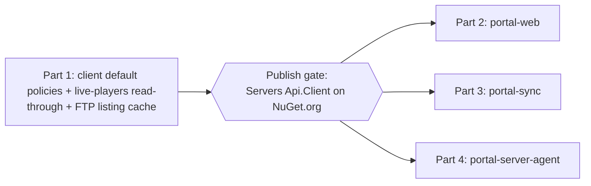

# Phase 3 — Servers Integration API Caching (Executable Plan)

Caching for the **Servers Integration API** (live query, RCON, FTP maps). **Part 1 implements caching in the API** (default client policies + the API's own server-side caching: live-players read-through and FTP listing). **Parts 2–4 roll it out to its three consumers.**

> Read first: [Phase 1 — Client caching capability](../portal-caching-phase-1/README.md) (published) and [flow-changes.md → FC-1 / FC-5](../portal-caching-spec/flow-changes.md).

## Structure

## What Phase 3 delivers

- **In the API (Part 1):**
  - The client package ships **default policies** (short-TTL cache for read-shaped query/status; `NotCached` for RCON/mutations).
  - **FC-1 live-players read-through:** `QueryController.GetServerStatus` reads LiveStatus (via the Repository API client) staleness-gated (serve if `age < maxStaleness`, else live-query — **not** written back to the enriched LiveStatus), replacing the per-instance 300s `IMemoryCache`.
  - **FC-5 FTP listing:** `FileBrowseController`'s 30s per-instance cache is standardised as **L1** via the policy model, with invalidate-on-write (upload/delete). Low-frequency admin op — no shared-account dependency.
- **In every consumer (Parts 2–4):** adopt the published client, prefer the staleness-gated status, and drop redundant direct-query paths where the cache is fresh.

## Consumers (rollout order)

| Part                               | Consumer              | Highlights                                                              |
| ---------------------------------- | --------------------- | ----------------------------------------------------------------------- |
| [2](part-2-portal-web.md)          | `portal-web`          | Admin live-view uses staleness-gated status; live query only when stale |
| [3](part-3-portal-sync.md)         | `portal-sync`         | Map sync adopts client defaults                                         |
| [4](part-4-portal-server-agent.md) | `portal-server-agent` | Adopt client defaults for Servers API reads                             |

## Golden rules

- Git hands-off; no secrets; follow each repo's `AGENTS.md`; build + test + `dotnet format --verify-no-changes` per step.
- **Publish gate:** finish Part 1, publish the Servers `Api.Client`, then consumers adopt. No cross-repo project references.
- RCON/mutations are always `NotCached`; moderation actions still emit `IAuditLogger` events.

## Definition of done

- Part 1 published; live-players read-through and FTP L1 cache live; per-instance `IMemoryCache` retired from `QueryController`/`FileBrowseController`.
- All three consumers on the new client version, green on build/test/format.
- Fewer direct RCON/UDP queries per server (App Insights) when LiveStatus is fresh.

## Documents

| Doc                                                                    | Purpose                                                                                                            |
| ---------------------------------------------------------------------- | ------------------------------------------------------------------------------------------------------------------ |
| [part-1-servers-integration-api.md](part-1-servers-integration-api.md) | Implement caching in the Servers Integration API: client defaults + FC-1 read-through + FC-5 FTP L1; publish gate. |
| part-2…part-4                                                          | Roll out to each consumer (see table above).                                                                       |

## Next

Phase 4 (optional) — Cosmos backend + `cache-invalidation` topic, only if native TTL / push invalidation is justified (see [spec README → rollout phases](../portal-caching-spec/README.md#rollout-phases)).
