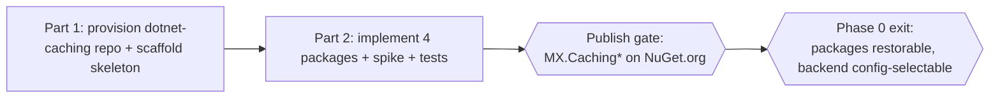

# Phase 0 — MX.Caching Library Foundation (Executable Plan)

This folder is the **detailed, execute-it-verbatim** plan for the foundational phase of the [portal-caching-spec](../portal-caching-spec/README.md) specification. It expands [spec README → rollout phases → Phase 0](../portal-caching-spec/README.md#rollout-phases) into a form a **lesser agent can execute step by step**.

> Read the design first: [spec.md → MX.Caching facade](../portal-caching-spec/spec.md#mxcaching-facade-over-hybridcache), then this folder (the *how*).

## What Phase 0 delivers

**No consumer is wired in Phase 0.** This phase only builds and publishes the shared caching library — a new `dotnet-caching` repo and the `MX.Caching*` NuGet packages — that every later phase consumes. The client `.WithCaching(...)` capability (Phase 1) and the per-API rollout (Phases 2–3) are **out of scope** here.

- **Part 1 — repo & scaffolding** ([part-1-repo-and-scaffold.md](part-1-repo-and-scaffold.md)). Provision the `dotnet-caching` repo via `platform-workloads`, scaffold it to org standards (solution, empty package projects, workflows, metadata, tasks). Exit: CI green on an empty skeleton that produces `.nupkg`s.
- **Part 2 — implement, test & publish the packages** ([part-2-packages.md](part-2-packages.md)). Implement `MX.Caching.Abstractions`, `MX.Caching`, `MX.Caching.TableStorage`, `MX.Caching.Testing`; resolve the tag-eviction-over-Table spike; test; cut the first NBGV release to NuGet. **Gated on NuGet publish** — no downstream phase starts until the packages restore from NuGet.org.

## Resolved decisions (locked for this plan)

| #   | Decision          | Choice                                                                                                                                                                     |
| --- | ----------------- | -------------------------------------------------------------------------------------------------------------------------------------------------------------------------- |
| 1   | Library location  | **Its own repo** (`dotnet-caching`), not inside `api-client-abstractions` — `portal-repository` consumes it server-side and must not take a dependency on `MX.Api.Client`. |
| 2   | Repo name         | `dotnet-caching` (org style: descriptive, no `mx-` prefix; packages are `MX.*`).                                                                                           |
| 3   | Packages          | `MX.Caching.Abstractions`, `MX.Caching`, `MX.Caching.TableStorage`, `MX.Caching.Testing`. `MX.Caching.Cosmos` **deferred**.                                                |
| 4   | Primitives        | **.NET 9 `HybridCache`** does L1/L2/stampede/tags/serialization; the facade adds only the policy model + (later) the client decorator.                                     |
| 5   | Default backend   | **Memory** is the library default. **Table Storage** `IDistributedCache` is selected explicitly by config (`MxCaching:Backend=TableStorage`) for shared L2 caching. Redis/Cosmos are config-swappable later. |
| 6   | Target frameworks | `net9.0;net10.0`; **NBGV** versioning starting `0.1`.                                                                                                                      |
| 7   | Publish feed      | **NuGet.org**, via `Release - Version and Tag` → `Release - Publish NuGet` (mirrors `api-client-abstractions`).                                                            |

Carried from the design: Table Storage on cost grounds (no Redis); the **tag-eviction-over-Table spike** is the only open technical risk and must be resolved before a `1.0`; consumers adopt in later phases (NuGet dependency gate).

## Golden rules for the executing agent

- **Do not** run git write ops (commit/push/branch) unless the requester asks. **Do not** introduce secrets or hard-coded GUIDs/connection strings. Follow the repo's `AGENTS.md`.
- After any .NET change, the repo's **build + test + `dotnet format --verify-no-changes`** must pass before a step is "done".
- **Surface the publish gate explicitly** (Fraser's NuGet dependency gate): finish Part 2, get the packages published/reviewed, then later phases consume them. Do not bridge with cross-repo project references.
- The `platform-workloads` PR (Part 1) is a **package/infra prerequisite** — open it first; the repo must exist before package work.
- Auth is **OIDC / managed identity only** — the Table Storage backend uses `DefaultAzureCredential`, never keys or connection strings.
- Prefer the repo's **VS Code tasks** (`dotnet: build`, `dotnet: format`) when present; else use the fallback commands in each part.

## Definition of done for Phase 0

- `dotnet-caching` repo exists (via merged `platform-workloads` PR) with the `main-protection` ruleset and NuGet publish environment.
- Four packages published to NuGet.org (`0.x`), multi-TFM (`net9.0;net10.0`), NBGV-versioned, each with a package README, restorable by a scratch project.
- `AddMxCaching(config)` selects the memory backend by default; Table Storage is selected explicitly through configuration with **no code change**.
- Policy precedence (`config → override → default → uncached`) and the `NotCached` guard are covered by tests.
- The tag-eviction-over-Table spike is resolved and documented (tag side-index built if required).
- No consumer has been wired (that is Phase 2+).

## Documents

| Doc                                                        | Purpose                                                                                                                                               |
| ---------------------------------------------------------- | ----------------------------------------------------------------------------------------------------------------------------------------------------- |
| [part-1-repo-and-scaffold.md](part-1-repo-and-scaffold.md) | Provision the `dotnet-caching` repo via `platform-workloads` and scaffold it to org standards (solution, empty projects, workflows, metadata, tasks). |
| [part-2-packages.md](part-2-packages.md)                   | Implement the four packages, resolve the tag-eviction spike, test, and publish the first NBGV release to NuGet.                                       |

## Next

[Phase 1 — Client caching capability](../portal-caching-phase-1/README.md) adds the `.WithCaching(...)` fluent decorator + policy model in `MX.Api.Client`, consuming these packages. Phase 2 then implements caching in the Repository API (client default policies + server-side cache-aside) and rolls it out to consumers; Phase 3 does the same for the Servers Integration API.
