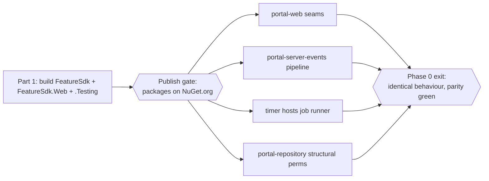

# Phase 0 — Feature SDK Foundation & Host Integration (Executable Plan)

This folder is the **detailed, execute-it-verbatim** plan for the first phase of the feature platform (see the [specification](../portal-features-spec/README.md)) — building & publishing the Feature SDK and wiring the host seams. It is written so a **lesser agent can execute step by step**.

> Read the design first: [architecture.md](../portal-features-spec/architecture.md) (the *why*), then this folder (the *how*).

## What Phase 0 delivers

**No feature moves in Phase 0.** The estate keeps behaving identically. Phase 0 builds the SDK and re-shapes each host to run its **existing** logic through the new SDK contracts (parity), so Phase 1 (Maps) can then move code into packages with confidence.

- **Part 1 — build & publish the SDK** ([part-1-sdk.md](part-1-sdk.md)). A new `portal-feature-sdk` repo with two packages (`FeatureSdk`, `FeatureSdk.Web`) + `.Testing` companions: the extension contracts **and** the host infrastructure (pipeline, job runner, default RCON gateway, default L0/L1 cache, context factory). `FeatureSdk.Web.Testing` also supplies the reusable reference host and Playwright fixture used by every feature repository. **Gated on NuGet publish** — Part 2 does not start until the packages restore from NuGet.org.
- **Part 2 — integrate the SDK into the consuming hosts** ([part-2-integration.md](part-2-integration.md)). Wire `portal-web`, `portal-server-events`, `portal-repository-func`, `portal-sync`, and `portal-repository` to the SDK contracts, registering today's implementations as in-host contributors/handlers. Proven by **characterization (golden-master)** tests and **Playwright semantic parity**, with a small, separately identified host-owned visual baseline.

## Resolved decisions (locked for this plan)

| #   | Decision                        | Choice                                                                                                                                                                        |
| --- | ------------------------------- | ----------------------------------------------------------------------------------------------------------------------------------------------------------------------------- |
| 1   | Event pipeline scope in Phase 0 | **Full** — decompose **all** `portal-server-events` processors into the ordered `IServerEventHandler<T>` pipeline now.                                                        |
| 2   | Handler event contract          | **SDK-owned event records**; each host **maps** the `Server.Events.Abstractions.V1` wire DTO into the SDK record before running the pipeline.                                 |
| 3   | portal-web composability        | **In Phase 0** — refactor nav / profile / dashboard / settings to SDK-driven loops, registering existing items as in-host contributors.                                       |
| 4   | Publish feed                    | **NuGet.org**, via `Release - Version and Tag` → `Release - Publish NuGet` (mirrors `api-client-abstractions`).                                                               |
| 5   | Host scope                      | `portal-web`, `portal-server-events`, `portal-repository-func`, `portal-sync`, `portal-repository`. `portal-servers-integration` and `portal-server-agent` are **untouched**. |

Carried from the design: walking-skeleton (freeze SDK at `v1.0` **after Phase 4** (AutoAdmin retire), not now — Phase 0 publishes `0.x` and the SDK keeps evolving through Phase 4); lean packaging; structural permission validation; feature-flag cutover (flags are **wired** in Phase 0 but **no feature flag is switched** — nothing moves yet); `IFeatureCache` ships L0/L1, adopts L2 later.

## Golden rules for the executing agent

- **Do not** run git write ops (commit/push/branch) unless the requester asks. **Do not** introduce secrets or hard-coded GUIDs/connection strings. Follow each repo's `AGENTS.md`.
- After any .NET change, the repo's **build + test + `dotnet format --verify-no-changes`** must pass before the step is "done".
- **Behaviour must not change in Phase 0.** If a refactor would alter behaviour, stop and raise it — parity is the whole point.
- **Surface the publish gate explicitly** (Fraser's NuGet dependency gate): finish Part 1, get the packages published/reviewed, then start Part 2. Do not bridge with cross-repo project references.
- Prefer the repo's **VS Code tasks** (`dotnet: build`, `dotnet: format`) when present; else use the fallback commands in each part.

## Definition of done for Phase 0

- SDK `0.x` published to NuGet.org and restorable by a scratch project.
- `FeatureSdk.Web.Testing` can launch a sample RCL in its reference host and prove route, contributor, authorization, settings, static-asset, and browser-error behaviour in Chromium.
- All five hosts build/test/format green and behave **identically** (characterization + Playwright semantic parity); the small portal-web visual baseline is green.
- `portal-server-events` runs every queue through the SDK pipeline; `portal-web` renders nav/profile/dashboard/settings from contributors; timer hosts run jobs via the runner; `portal-repository` does additive structural permission validation.
- `Microsoft.FeatureManagement` is wired in every host that will need it in Phase 1; **no feature flag has been switched on**.
- No feature code has moved into a feature repo yet (that is Phase 1).

## Documents

| Doc                                            | Purpose                                                                                                                                                      |
| ---------------------------------------------- | ------------------------------------------------------------------------------------------------------------------------------------------------------------ |
| [part-1-sdk.md](part-1-sdk.md)                 | Build the SDK: repo scaffolding, every project, every interface + default implementation, reusable feature-web test host, tests, and the publish gate.       |
| [part-2-integration.md](part-2-integration.md) | Integrate the SDK into the five hosts: per-host seam steps, the full events-pipeline decomposition, discovery-driven Playwright parity, and the exit gate.   |

## Next

[Phase 1 — Maps Feature: Build & Side-by-Side](../portal-features-phase-1/README.md) moves Maps into `portal-feature-maps` behind `Feature.Maps.V2`. [Phase 2](../portal-features-phase-2/README.md) then retires the legacy maps code. (The SDK core is frozen at `v1.0` later, after Phase 4.)
