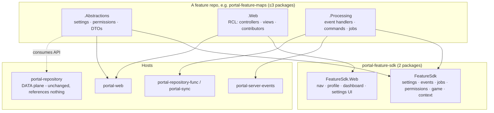
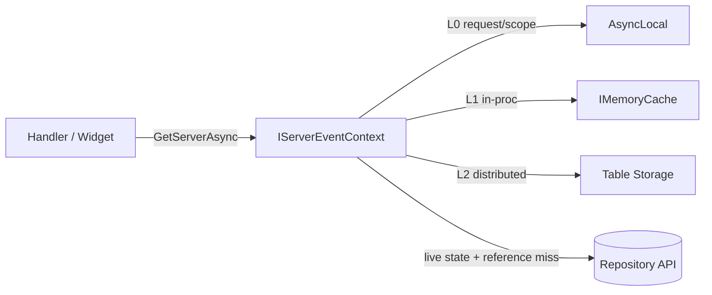

# Target Architecture — Feature Plugins via Compile-Time Composition

Each host is a thin **composition shell**; each feature is a **self-contained repository** publishing a small set of NuGet packages that plug into well-known SDK contracts.

## Design principles

1. **A feature is a repository → a package set → one change unit.** Adding a chat command or VPN Protection is one PR in one repo, then a version bump consumed by the hosts.
2. **Compile-time composition, not runtime assembly loading.** Each host references the feature packages it needs and the feature self-registers via `AddXxxFeature*()` extensions. Hosts stay single deployables — no `AssemblyLoadContext`, no plugin-drop folders, no change to OIDC/managed-identity/observability. Runtime assembly loading is out of scope.
3. **The SDK holds contracts + host infrastructure only — never feature implementations.** The Feature SDK ships the extension interfaces, the dispatchers/aggregators/runners that host them, and shared capabilities (RCON gateway, cache, context). Feature *logic* lives in feature repos.
4. **`portal-repository` stays the data plane.** Features never touch SQL; they consume the typed Repository API client. The data border is unchanged, and the repository never references feature packages.
5. **One feature, many planes — packaged by dependency, not by plane.** A feature contributes to web, events, and jobs at once, but ships the **minimum** packages its dependencies require (see [Packaging](#packaging--naming)).
6. **Migrate behind a flag.** Every feature cutover is gated by `Microsoft.FeatureManagement` so legacy and new run side-by-side, switch per environment, and roll back by flag flip + host restart (see [Cutover](#cutover-with-feature-flags)).

## Core, platform, and features

The estate has **three tiers**, and the split is what keeps features small:

1. **Data plane** — `portal-repository`, the single system of record. Unchanged.
2. **Platform / core** — the canonical write path, the cross-cutting capabilities many features depend on, and all host/SDK runtime plumbing. **Owned by the hosts and the SDK, never by a feature.**
3. **Features** — plugins that **enrich** (derive/add data) or **react** (take action) on top of core, through SDK contracts.

**A capability is core if any of these is true:**

- It writes the **canonical record** for an event (persistence / system-of-record write).
- **Two or more features depend on it** — current map/players, player identity, GeoIP enrichment, permissions, RCON transport.
- It is **host/SDK runtime plumbing** — Service Bus / timer trigger stubs, the pipeline / job runners, API-client registration, App Configuration, health, observability.
- It is a **cross-cutting settings namespace** not owned by a single domain — `Shared`, `Agent`, `ServerList`.

Otherwise it is a **feature**: a single-domain enrichment or reaction. Where a domain has both aspects (e.g. bans: persistence + file-sync enforcement), the canonical write stays core and only the reaction becomes the feature.

The classification of the estate is in [feature-catalog.md](feature-catalog.md#platform-core-vs-feature-boundary).

## Extension planes

A *plane* is a host type with its own extension contract surface.



| Plane            | Host(s)                                                          | SDK package                | A feature contributes…                                                                                           |
| ---------------- | ---------------------------------------------------------------- | -------------------------- | ---------------------------------------------------------------------------------------------------------------- |
| **Web**          | `portal-web`                                                     | `FeatureSdk.Web`           | navigation entries, profile blocks, dashboard widgets, settings sections, controllers/areas/views, auth policies |
| **ServerEvents** | `portal-server-events`                                           | `FeatureSdk`               | event handlers, chat commands, enrichment providers — all off a shared context                                   |
| **Jobs**         | `portal-repository-func`, `portal-sync`                          | `FeatureSdk`               | scheduled/timer jobs **and reconciliation jobs** (ordered, idempotent) + manual HTTP triggers                    |
| **Settings**     | all                                                              | `FeatureSdk`               | typed settings contracts + validators per namespace                                                              |
| **Permissions**  | `portal-web` (authority) + `portal-repository` (structural only) | `FeatureSdk`               | permission definitions + policies (data plane validates structurally, references nothing)                        |
| **Data**         | `portal-repository`                                              | *(none — API client only)* | nothing; features are API clients                                                                                |
| **Ingest**       | `portal-server-agent`                                            | *(later)*                  | optionally, log-line parsers                                                                                     |

> "Plane" is a **conceptual** grouping of extension points by host type. **Packaging is lean** — the SDK is two packages (`FeatureSdk` framework-agnostic + `FeatureSdk.Web`), and a feature ships at most three (`.Abstractions` / `.Web` / `.Processing`). See [Packaging](#packaging--naming).

Every contribution across every plane also carries **game applicability** (`SupportedGames`) — see [Game capability model](#cross-cutting-game-capability-model).

## The Feature SDK contracts

### Settings plane (foundational)

Settings are stored as **`namespace` + opaque JSON** (the `GlobalConfigurations` / `GameServerConfigurations` tables). `portal-repository` never needs the typed contract — the typed contract is a (de)serialization convenience for the *consumers*. So the **contract belongs to the feature**, and the data border stays clean.

```csharp
public interface IFeatureSettingsContract
{
    static abstract string Namespace { get; }      // e.g. "vpnProtection"
    static abstract SettingsScope Scope { get; }    // Global | GameServer | Both
}
public interface IFeatureSettingsValidator<TContract> { SettingsValidationResult Validate(TContract value); }
```

**Ownership and validation (mirrors the [permissions plane](#permissions-plane)):**

- **The feature owns its namespace contract + validator** in `.Abstractions`. Adding or changing a namespace is a **feature-only** change.
- **`portal-repository` validates structurally only for feature namespaces** — well-formed JSON for a non-empty namespace — and references **no** feature package. Adding a **feature** namespace is a **zero-change** to the repository. It retains **typed validation for platform namespaces** via the platform `Settings.Contracts.V1` package, so the border is *structural for feature namespaces + platform-typed for platform namespaces*.
- **The writer (`portal-web`) validates semantically** with the feature's validator before persisting via the Repository API.
- **Namespace ownership is 1:1** and the SDK settings registry **fails fast on a duplicate**. Genuinely cross-cutting namespaces — `Shared`, `Agent`, `ServerList` plus platform transport/config namespaces consumed by the untouched integration hosts (`rcon`, `fileTransport`) and platform pruning (`events`) — are **platform-owned**; their contracts live in the **`Settings.Contracts.V1` platform settings-contracts package**, which shrinks as features pull their namespaces out. Feature namespaces such as `banfiles` (Bans) and `cod4x*` (Server Integration Config) are **feature-owned**.

**The web settings pages are section shells.** `GlobalSettings` / `GameServers` loop over registered `ISettingsSection`s; each feature's `.Web` package contributes its section (view model + partial + validator), so those pages **pull the UI from the feature NuGet** — no shared-Razor edit per feature.

**Generic resolver.** The SDK provides a settings resolver (per-server override → global → built-in default) that reads the namespace JSON via the Repository client and deserialises with the feature contract; features never parse raw namespace JSON.

**Migration compatibility.** Because the wire format is JSON, a migrating feature ships a **wire-compatible copy** of its contract (identical JSON shape); legacy and feature paths interoperate through the stored JSON during side-by-side, and the central copy in `Settings.Contracts.V1` is removed in the feature's retire phase.

### ServerEvents plane — an ordered pipeline

`portal-server-events` runs an **ordered handler pipeline** per event, with a **data-only context** and **capabilities injected via DI**.

```csharp
// Wire contract stays in Server.Events.Abstractions.V1 (shared with the agent producer).
// The host maps each raw queue message into a handler-facing SDK event record.
public interface IServerEvent { Guid ServerId { get; } GameType GameType { get; } }
public sealed record ChatMessageEvent(/* … */) : IServerEvent;   // + PlayerConnected, MapChange, BanApplied, …

public interface IServerEventHandler<TEvent> : IGameScoped where TEvent : IServerEvent
{
    int Order { get; }   // stage band (below)
    Task HandleAsync(TEvent evt, IServerEventContext ctx, CancellationToken ct);
}
```

**Ordered stages.** The pipeline sorts handlers by `Order`, filters by `SupportedGames`, and runs **every** matching handler **in sequence**, in order (handlers return `Task` — there is no short-circuit). `Order` **bands are advisory labels**, not a prescriptive ordering — each handler's `Order` must reproduce the **actual current sequence** of the processor it is extracted from (captured by the characterization baseline), which is **not** always "persist first, then enrich, then react":

| Band    | Stage                  | Typical handlers                                                  |
| ------- | ---------------------- | ----------------------------------------------------------------- |
| 0–99    | **Core / persistence** | write chat message, record connect/disconnect, persist map change |
| 100–199 | **Enrichment**         | GeoIP, player-id resolution, VPN evaluation                       |
| 200–299 | **Reaction**           | chat commands, welcome messages, chat moderation                  |

Where the real processor does not follow the band order, **the actual order wins** — assign `Order` values to match today's sequence and treat the band as a hint. Three concrete examples from the current estate:

- **Chat messages** run **persist → command dispatch → moderation** today. Moderation is a **passive side-effect** (it records an `Observation` admin action; it never blocks the command or the message), so it is ordered **after** command dispatch. Chat handlers are genuinely independent, so the **pipeline** has **no stop primitive** — every matching chat handler runs.
- **Server status** resolves each player's id + GeoIP **to build** the live-player record that is then written — enrichment **precedes and feeds** the write, so it stays a **single core handler** rather than being split into write-before-enrich bands.
- **Connection events** (`PlayerConnected` / `PlayerIpResolved`) are **not** decomposed into independent handlers either. In the real code, GeoIP enrichment feeds the VPN guard **and** the welcome, and the **welcome is suppressed when the guard is destructive** (a VPN kick). That data + control coupling can't be expressed by independent, order-only handlers, so each stays a **single platform-owned core orchestration handler** that calls **feature collaborators** — see [Connection orchestration](#connection-orchestration-single-core-handler-feature-collaborators).

**Persistence (canonical writes) is platform-owned; features own enrichment and reaction.** Writing the canonical record for an event — persist the chat message, record connect/disconnect, persist the map change, persist the ban — is a **host/platform** responsibility, not something a feature re-implements. Features contribute enrichment and reaction handlers only, at whatever `Order` reproduces today's sequence. (For Maps, the map-change *persistence* stays a platform core handler while the Maps feature owns the rotation/popularity *reaction*.)

**`Order` values are a shared numbering convention** documented in the SDK; two handlers with the same `Order` are tie-broken deterministically (by handler type name). Handlers that genuinely depend on each other must set explicit, distinct `Order`s.

**Context is data; capabilities are injected.** The context carries *what happened* with lazy, cached lookups. RCON, cache, audit, and API clients are constructor-injected into the handler.

```csharp
public interface IServerEventContext                     // DATA only
{
    Guid ServerId { get; }
    GameType GameType { get; }
    DateTime EventGeneratedUtc { get; }
    long SequenceId { get; }
    ValueTask<ServerReference> GetServerAsync(CancellationToken ct);
    ValueTask<PlayerReference?> GetPlayerAsync(string guid, CancellationToken ct);
    ValueTask<LiveServerState> GetLiveStateAsync(CancellationToken ct);   // current map/players
}
// Handlers inject capabilities via DI: IRconGateway, IFeatureCache, IAuditLogger,
// IRepositoryApiClient — never the other way round.
```

`IChatCommand` is retained as a **sub-contract inside the Chat Commands feature** (its reaction-band handler dispatches registered commands), so command authors keep the tiny surface they have today.

#### Connection orchestration (single core handler, feature collaborators)

`PlayerConnected` and `PlayerIpResolved` each stay a **single platform-owned core handler** (`IServerEventHandler<PlayerConnectedEvent>` / `IServerEventHandler<PlayerIpResolvedEvent>`). The handler owns persistence **and** the fixed sequence; feature logic plugs in as **collaborators** with **no-op SDK defaults** and exactly **one active implementation** each (swapped by flag-gated registration during migration). This is the estate's *only* place with real inter-step coupling; the generic pipeline stays coupling-free.

```csharp
// Mutable, one instance per connect / ip-resolved event; threaded through the collaborators.
public sealed class PlayerConnection
{
    public required Guid ServerId { get; init; }
    public required GameType GameType { get; init; }
    public required Guid PlayerId { get; init; }
    public required string PlayerGuid { get; init; }
    public required string Username { get; init; }
    public int? SlotId { get; init; }
    public IReadOnlyCollection<string> PlayerTags { get; set; } = Array.Empty<string>();
    public IpIntelligenceDto? Intelligence { get; set; }   // set by the enricher; read by the guard + greeter
    public bool GuardWasDestructive { get; set; }          // set by the guard (e.g. VPN kick) => greeter is skipped
}

public interface IConnectionEnricher                    { Task EnrichAsync(PlayerConnection c, CancellationToken ct); }  // platform GeoIP
public interface IConnectionGuard       : IGameScoped   { Task GuardAsync(PlayerConnection c, CancellationToken ct); }   // AutoAdmin: VPN-detected tag + VPN kick
public interface IProtectedNameEnforcer : IGameScoped   { Task EnforceAsync(PlayerConnection c, CancellationToken ct); } // AutoAdmin (CoD4x)
public interface IConnectionGreeter     : IGameScoped   { Task GreetAsync(PlayerConnection c, CancellationToken ct); }   // Welcome Messages
```

The core `PlayerConnected` handler runs, reproducing today's sequence exactly:

```text
persist/create player, record session, persist IP          (core)
await protectedNameEnforcer.EnforceAsync(c)                (CoD4x)
await enricher.EnrichAsync(c)                              (platform GeoIP -> c.Intelligence)
await guard.GuardAsync(c)                                  (AutoAdmin: VPN-detected tag + VPN kick -> c.GuardWasDestructive)
if (!c.GuardWasDestructive) await greeter.GreetAsync(c)    (Welcome)
```

`PlayerIpResolved` runs the shorter `persist IP → enrich → guard` (no protected-name, no greeter). A feature owns the **collaborator**, never the orchestration — so AutoAdmin's VPN is an `IConnectionGuard`, **not** an `IServerEventHandler` (decision 17). `IpIntelligenceDto` comes from `MX.GeoLocation.Abstractions` (DTO-only dependency on `FeatureSdk`); the platform enricher implementation is host-registered (it needs `IGeoLocationApiClient`), and the SDK ships a no-op default.

### Web plane

Hard-coded nav and fixed ViewComponents are replaced with contribution contracts, plus MVC **Application Parts** so a feature package can ship controllers, views, and areas.

```csharp
// All web contracts extend IGameScoped; nav items carry their own per-item policy,
// while blocks / widgets / sections carry a single gating policy.
public interface INavigationContributor : IGameScoped
{
    int Order { get; }
    IEnumerable<NavItem> GetItems(NavigationContext ctx); // ctx exposes IAuthorizationService; each NavItem has a Policy
}

public interface IPlayerProfileBlock : IGameScoped
{
    int Order { get; }
    string Policy { get; }
    Task<IViewComponentResult?> RenderAsync(PlayerProfileContext ctx); // null = hide
}

public interface IDashboardWidget : IGameScoped { int Order { get; } string Policy { get; } /* … */ }

public interface ISettingsSection : IGameScoped
{
    string Namespace { get; }        // ties to the Settings plane
    string DisplayName { get; }
    SettingsScope Scope { get; }
    string Policy { get; }
    // renders/binds the typed contract form
}
```

Host registration (lean packages, flag-gated during migration — see [Discovery & registration](#discovery--registration-pattern)):

```csharp
// portal-web Program.cs
builder.Services.AddPortalFeatureWeb();          // SDK: nav aggregator, profile-block runner, settings UI shell
if (features.IsEnabled("Maps.V2"))
    builder.Services.AddMapsFeatureContracts().AddMapsFeatureWeb();   // Features.Maps.Abstractions + .Web
```

`_Navigation.cshtml` is a loop over `INavigationContributor` output; the player profile is a loop over ordered `IPlayerProfileBlock`s; the settings pages are a loop over `ISettingsSection`s. **Adding a feature does not edit shared Razor.**

**Feature web packages are Razor Class Libraries.** A `.Web` package ships its controllers, views, and static assets as an RCL (`Microsoft.NET.Sdk.Razor`); `AddFeatureControllers(assembly)` registers an MVC `ApplicationPart` so the host discovers the controllers, and static assets are served under `_content/<package>`. Features **reuse the central design system** (Bootstrap + the portal-web token set and UI-standards components) and ship little or no bespoke CSS — the SCSS/npm build stays central in `portal-web`. A feature that genuinely needs styling ships *compiled* CSS via RCL static assets; features never run npm. The host filters every surface by game **and** authorization.

### UI testing ownership

UI testing follows the same ownership boundary as the Web plane: **feature behaviour is proven in the feature repository before publish; host composition is proven in `portal-web` after package consumption.** Moving a controller or view into an RCL must not move its primary browser coverage back into the host.

| Layer | Owner | Required coverage |
| --- | --- | --- |
| Feature web unit/component | `portal-feature-<name>` | Contributors, view models, validators, controller actions, policy/game metadata, and settings serialization/round-trip. |
| Feature functional browser | `portal-feature-<name>` | Chromium against an SDK reference host: feature routes, forms/workflows, feature navigation/profile/dashboard/settings surfaces, static assets, authorization visibility, and no console/page/same-origin request errors. |
| Host composition browser | `portal-web` | Package/ApplicationPart discovery, real portal layout and design-system compatibility, real authorization-policy wiring, route/contributor uniqueness, and feature-flag off/on parity during migration. |
| Host visual compatibility | `portal-web` | A deliberately small screenshot-baseline suite for high-risk shared-shell surfaces. Full feature visual suites do not live here. |
| Optional deployed smoke | `portal-web` deployment workflow | If adopted, keep to small read-only checks against the deployed Development app after deployment; do not duplicate stateful feature workflows. |

`XtremeIdiots.Portal.FeatureSdk.Web.Testing` supplies the reusable reference host used by feature repositories. It must provide:

- a minimal ASP.NET Core app with MVC, Razor, static web assets, and `AddFeatureControllers(assembly)`;
- fake authentication principals and configurable policy outcomes;
- deterministic fake/recording host services for Repository/API clients and in-memory settings persistence;
- rendering shells for navigation, profile blocks, dashboard widgets, and settings sections;
- a Kestrel-on-loopback Playwright fixture, isolated browser contexts, and assertions for console errors, page errors, failed same-origin requests/responses, and unexpected external requests.

The reference host validates the **published Web-plane contract**, not `portal-web` internals. It may include a minimal stable layout and test CSS, but it does not copy the portal-web application or claim pixel parity with the production design system.

Feature repositories use semantic assertions (`role`, label, route, stable `data-testid`, persisted payload) as the default. Screenshot comparison is reserved for `portal-web` because the central design system and shared layout remain host-owned. If those assets later become a versioned shared RCL, visual ownership can move with that dependency.

To avoid host test edits for every feature, portal-web coverage must be discovery-driven wherever the SDK already exposes metadata:

- discover RCL controllers from all registered MVC `ApplicationPart`s, not only the portal-web assembly;
- derive navigation/profile/dashboard/settings coverage from registered contributors;
- assert unique routes, contributor keys/order, settings namespaces, and permission claims;
- allow the test host to set `FeatureManagement:<Name>` before application composition so both flag states can be started deterministically.

**Browser test gate.** A feature with a `.Web` package is not publishable until its feature-owned Playwright project is run directly and executes at least one test successfully. A solution-wide name filter is insufficient because `dotnet test` succeeds when a filter matches zero tests. Host-side Playwright cannot compensate for missing feature-repository coverage.

### Jobs & reconciliation plane

Two job shapes, both on the timer hosts. Reconciliation is a distinct shape because the estate's reconciliations have **ordering, idempotency, and system-vs-manual** constraints.

```csharp
public interface IScheduledJob : IGameScoped
{
    string Name { get; }
    string CronExpression { get; }     // host maps to a TimerTrigger + paired manual HTTP trigger
    Task ExecuteAsync(JobContext ctx, CancellationToken ct);
}

// Reconciliation is a distinct, ordered, idempotent job shape.
public interface IReconciliationJob : IScheduledJob
{
    string Set { get; }                    // group key, e.g. "PlayerTags" — only jobs in a set order together
    ReconciliationPhase Phase { get; }     // Reset -> Project -> Reconcile
    int Order { get; }                     // deterministic ordering within a phase
}
```

Timer hosts (`portal-repository-func`, `portal-sync`) run a thin host trigger stub per job that calls the SDK job runner (see [Host-owned triggers](#host-owned-triggers-feature-owned-logic)); the job **body** moves into the feature's `.Processing` package. Reconciliation constraints the model preserves:

- **Ordering / phases within a `Set`.** Jobs sharing a `Set` (e.g. `PlayerTags`) run in `Phase` then `Order`: reset must precede reconcile; unrelated sets never serialise against each other. `RunSetAsync` (which sorts by `Phase` then `Order`) is the mechanism for any set driven by a **single** trigger. In the current estate the daily player-tag jobs keep their **separate cron triggers** (03:00 → 03:30 → 04:00) for parity, so their reset-before-reconcile ordering is preserved by that spacing; `Phase`/`Order` document and enforce the invariant for set-driven runs and are available for later consolidation. Where a set spans hosts, the cross-host leg is independently **idempotent** rather than relying on cross-host ordering.
- **System vs manually-assigned preservation.** `UserProfileForumsSync` regenerates *system* claims from forum groups while **preserving manually-assigned `AdditionalPermission` claims** (separate → regenerate → merge). The SDK exposes this separation as a helper so a feature cannot accidentally clobber manual grants.
- **Idempotency.** Reconciliations are safe to re-run (they back the manual HTTP triggers). `JobContext` carries a run token; features reuse the existing idempotency-store pattern.
- **Estate-wide vs feature-owned.** Platform-level reconciliations (`UserProfileForumsSync`, generic pruning, the player-tag **reset**) stay platform capabilities. Feature-owned reconciliations (each feature's tag reconcile, ban-file import, map-rotation cleanup, map-image/redirect sync, map popularity) move into the owning feature.
- **Cross-feature reconciliation sets.** A `Set` can span features: the player-tag set has a platform-owned **reset** (`Phase=Reset`, clears *system-assigned* tags) that must precede **every** feature's tag reconciler (`Phase=Reconcile`). When a set is driven by a single trigger, the core job runner enforces `Phase` then `Order` across all registered jobs regardless of which feature contributed them; the player-tag set currently preserves the reset-before-reconcile invariant through its retained cron spacing (parity), with `Phase`/`Order` documenting the invariant (see [Player tags plane](#player-tags-plane-core-substrate)).

The reconciliation inventory and its ownership split is in [feature-catalog.md](feature-catalog.md#reconciliation-ownership--game-scope).

## Host-owned triggers, feature-owned logic

There is one asymmetry between the web plane and the Functions planes:

- **Web (`portal-web`) is fully dynamic.** Feature controllers/views load at runtime via MVC **ApplicationParts** from the `.Web` RCL — adding a feature web surface needs **no host change** beyond the flag-gated `AddXxxFeatureWeb()` line.
- **Functions planes (events + jobs) keep their triggers in the host.** Azure Functions isolated-worker `[ServiceBusTrigger]` / `[TimerTrigger]` / `[HttpTrigger]` methods are discovered from the **host** assembly at build time and cannot ship from a referenced feature package. So the host owns a **thin trigger stub** per queue and per job schedule that maps the message / fires the timer and calls the SDK runner (`IServerEventPipeline` / `IJobRunner`). The **logic** — handlers, commands, jobs — lives in the feature `.Processing` package.

Consequences:

- For **existing** queues and job schedules, adding or moving a feature handler/job is a **feature-only** change — the host stub already dispatches whatever is registered.
- A **new event type / Service Bus queue** is a coordinated change: a new DTO in `Server.Events.Abstractions.V1` (shared with the agent producer) **and** a new trigger stub in the host — a small host PR.
- A **new job schedule** needs a small host stub (a `[TimerTrigger]` + paired manual `[HttpTrigger]` that call `IJobRunner.RunAsync("JobName")`). The job body lives in the feature.

## Shared context + cache

The events plane delivers a shared context with lazy-loaded, cached data via `IServerEventContext`. On the web plane, profile blocks and widgets receive their `PlayerProfileContext` / `NavigationContext` (carrying the relevant IDs) and inject `IFeatureCache` + the API clients directly. Both planes share the one `IFeatureCache` facade.



- **The SDK owns `IFeatureCache` and ships a built-in L0 (request/scope) + L1 (in-process) implementation** that works from day one.
- The context **de-duplicates reads within a single event/request** (L0) and shares stable reference reads across handlers (L1).
- **L2 (distributed) is deferred.** `IFeatureCache` keeps L2 behind the same interface; when added it sits on the org's `MX.Api.Client` cache capability (`WithCaching` / `SharedCacheConfiguration`, per-client scoped) rather than a bespoke store — no feature changes. See `patterns.api-client.instructions.md`.

## Cross-cutting: game capability model

The estate is multi-game (`GameType`: CoD2/4/4x/5, Insurgency, L4D2, Rust, Arma 1/2/3, Battlefield family, Minecraft, …), and features are **not uniformly available across games**. Game applicability is a first-class **declared** property on every contribution, and per-game RCON is abstracted once so features stop re-implementing the `switch`.

```csharp
// Every contribution can declare the games it applies to. Empty => all games.
public interface IGameScoped
{
    IReadOnlyCollection<GameType> SupportedGames { get; }
}
// IServerEventHandler<T>, IChatCommand, INavigationContributor, IPlayerProfileBlock,
// IDashboardWidget, ISettingsSection, IScheduledJob all extend IGameScoped.

// Per-game RCON is abstracted once in the SDK; the switch lives here, not in features.
public interface IRconGateway
{
    Task<string?> GetCurrentMapAsync(Guid serverId, GameType game, CancellationToken ct);
    Task SayAsync(Guid serverId, GameType game, string message, CancellationToken ct);
    Task KickAsync(Guid serverId, GameType game, int slot, string reason, CancellationToken ct);
    // …ban, mapchange, restart…
    bool Supports(GameType game, RconCapability capability);   // capability probing
}
```

Host behaviour:

- **Web** — a nav item / profile block / settings section is shown only when the feature supports the game(s) the user is scoped to, and for server-scoped surfaces, the server's `GameType` is supported. Game-exclusive surfaces (CoD4x plugin lifecycle) appear only for CoD4x servers.
- **ServerEvents** — the dispatcher skips handlers whose `SupportedGames` excludes the event's `GameType`.
- **Jobs** — reconciliation/sync jobs can be per-game and run only for supported games.
- **Capability probing** (`IRconGateway.Supports`) lets a feature degrade gracefully when a game lacks a capability instead of failing.

Game applicability is a **declared, host-enforced property**; adding a game to a feature is a one-line change in that feature.

## Permissions plane

The assignable-permission catalogue is distributed to features **without coupling the data plane to them**. `PermissionScope` (`Game` / `Server` / `GameOrServer`) drives claim-value validation. Roles (`SeniorAdmin` global; `HeadAdmin`/`GameAdmin`/`Moderator` game-scoped) come from forum sync; handlers check **both** roles and additional permissions.

```csharp
public interface IPermissionContributor
{
    IEnumerable<PermissionDefinition> GetPermissions();
}

public sealed record PermissionDefinition(
    string ClaimType, string DisplayName, string Description,
    string Domain, string? SubDomain,
    PermissionScope Scope);              // Game | Server | GameOrServer
```

- Each feature declares **its own** permission definitions in its `.Abstractions` package and contributes them via `IPermissionContributor`.
- **`portal-web` is the catalogue authority.** It references all feature packages, aggregates their definitions to register policies (`AddXtremeIdiotsPolicies` is a loop over contributions), renders the permissions UI, and **rejects unknown claim types at assignment time**.
- **`portal-repository` validates *structurally only*** and does **not** reference any feature package: a claim type must match the `{Domain}.{Action}` shape and the claim value must be a valid `GameType` (not `Unknown`) **or** a GUID. The exact per-permission scope is enforced by the web host, which owns the catalogue. **The data-plane border stays clean.**
- **Claim types are globally unique across features.** The `portal-web` aggregator **fails the build on a duplicate**. Domains map ~1:1 to features.

> **Read-only community tier — deferred.** Broad read-only access for more users is delivered later as its own feature on top of this permission plane (contributing read-eligible definitions and composing a tier). The existing role/claim model (`SeniorAdmin`/`HeadAdmin`/`GameAdmin`/`Moderator`, `RegisteredUser`, `ClanMember`) is used **as-is** until then.

## Player tags plane (core substrate)

Player tags are a **shared capability**, not a feature — moderation reads a tag (`ModerateChatTag`) to decide whether to run the paid Content Safety API, VPN protection writes a "VPN detected" tag, Player Tags owns the base connected-player tags, and future features will add their own. Because two or more features depend on tags, the substrate is **core** (the same test that keeps live status and RCON transport core).

The model mirrors the [permissions plane](#permissions-plane):

- **Core owns the substrate** — an SDK `IPlayerTagService` (add / remove / read a player's tags, backed by the Repository tag API) plus the player-tag **reconciliation set** orchestration (the `Reset` phase that clears system-assigned tags).
- **Features contribute their system-tag definitions** via an `ITagDefinitionContributor` (like `IPermissionContributor`); core aggregates them so the reset knows exactly which tags are system-owned and by whom, and never touches manually-assigned tags.
- **Each feature owns the reconciler that derives its tags** — Player Tags owns the connected-player reconcile; AutoAdmin owns the VPN-detected reconcile — each registered into the shared `PlayerTags` set (`Phase=Reconcile`) so they run after the core reset.
- **Features consume the core `IPlayerTagService` directly** — a feature never references the Player Tags *feature* to read or write a tag, so there is **no feature-to-feature dependency** for the common case. The "Player Tags" feature is just the **management UI** for tags.

`IPlayerTagService` + `ITagDefinitionContributor` are **core SDK** capabilities, built into the walking-skeleton SDK **before the Phase 4 freeze** and first consumed when a feature needs to read/write tags from a package (AutoAdmin, Phase 3).

## Packaging & naming

Package granularity is **driven by dependency boundaries, not by plane** — the only hard split is that ASP.NET Core MVC (web) must **not** leak into the Functions hosts.

**SDK — two packages (dedicated `portal-feature-sdk` repo):**

| Package                              | Contents                                                                                                                                                                                                                                                                                            | Key dependencies                                                                                                                             |
| ------------------------------------ | --------------------------------------------------------------------------------------------------------------------------------------------------------------------------------------------------------------------------------------------------------------------------------------------------- | -------------------------------------------------------------------------------------------------------------------------------------------- |
| `XtremeIdiots.Portal.FeatureSdk`     | framework-agnostic contracts (settings, events + pipeline, jobs, permissions, game, context, connection collaborators, tag substrate) **and** host infrastructure (dispatchers, job runner, default `IRconGateway`, default `IFeatureCache` L0/L1, context factory, no-op connection collaborators) | `MX.Api.Client`, Repository + Servers typed clients, `MX.GeoLocation.Abstractions` (DTO-only, for `IpIntelligenceDto`), `MX.Observability.*` |
| `XtremeIdiots.Portal.FeatureSdk.Web` | ASP.NET Core contracts (nav / profile / dashboard / settings) + web host infrastructure (aggregators, RCL/ApplicationPart support, tag helpers)                                                                                                                                                     | `FeatureSdk`, ASP.NET Core MVC                                                                                                               |

Each ships a `.Testing` companion. `FeatureSdk.Testing` contains the processing fakes (context, RCON gateway, cache, pipeline/connection harnesses). `FeatureSdk.Web.Testing` contains fake web contexts **and the reusable reference web host + Playwright fixture** that lets every feature test its RCL without referencing `portal-web`.

**Per feature — up to three packages, only those the feature needs:**

| Package                                                       | Contents                                                                                                  | Depends on                          |
| ------------------------------------------------------------- | --------------------------------------------------------------------------------------------------------- | ----------------------------------- |
| `XtremeIdiots.Portal.Features.<Name>.Abstractions`            | settings contract(s) + validators, DTOs, **permission definitions**, constants                            | `FeatureSdk`, `MX.Api.Abstractions` |
| `XtremeIdiots.Portal.Features.<Name>.Web` *(optional)*        | RCL: controllers, views, static assets, nav/profile/dashboard/settings contributors, `AddXxxFeatureWeb()` | `FeatureSdk.Web`, `.Abstractions`   |
| `XtremeIdiots.Portal.Features.<Name>.Processing` *(optional)* | event handlers, chat commands, **and** scheduled/reconciliation jobs, `AddXxxFeatureProcessing()`         | `FeatureSdk`, `.Abstractions`       |

Rules:

- **`.Web` is separate** because it drags in ASP.NET MVC that `portal-server-events` / `portal-repository-func` / `portal-sync` must not reference.
- **Events and jobs share one `.Processing` package** — both run on the same isolated-worker host stack. A host only *runs* what its SDK runner enumerates; an unused registration is harmless.
- **`portal-repository` references no feature package** (structural validation), so the `.Abstractions → FeatureSdk` chain never reaches the data plane.

All packages: multi-target `net9.0`/`net10.0`, NBGV versioning, `.Testing` companions where they have non-trivial logic.

Feature repositories that publish `.Web` also contain a non-packable `XtremeIdiots.Portal.Features.<Name>.Web.IntegrationTests` project. It references the feature `.Web`, `.Abstractions`, `FeatureSdk.Web.Testing`, `Microsoft.Playwright`, xUnit, and any deterministic client fakes needed by the scenarios. The standard CI path runs unit tests separately, then uses the versioned Playwright action to install Chromium, run that exact project, publish TRX, and fail if zero tests execute.

## Discovery & registration pattern

A feature ships **one idempotent DI extension per package it publishes**; the host calls them and (during migration) gates them behind a flag.

```csharp
// Features.Maps.Web  -> referenced only by portal-web
public static IServiceCollection AddMapsFeatureWeb(this IServiceCollection s)
{
    s.AddFeatureControllers(typeof(MapsController).Assembly);   // MVC ApplicationPart (RCL)
    s.AddNavigationContributor<MapsNavigation>();
    s.AddDashboardWidget<MapPopularityWidget>();
    // (Maps has no ISettingsSection — rotations are data, managed via the controllers.
    //  A feature WITH settings would call s.AddSettingsSection<TSection>() here.)
    return s;
}

// Features.Maps.Processing -> referenced by portal-server-events (+ the timer hosts)
public static IServiceCollection AddMapsFeatureProcessing(this IServiceCollection s)
{
    s.AddServerEventHandler<MapChangeEvent, MapChangeHandler>();
    s.AddChatCommand<MapVoteLikeCommand>();
    s.AddChatCommand<MapVoteDislikeCommand>();
    s.AddScheduledJob<MapPopularityJob>();
    s.AddScheduledJob<MapImageSyncJob>();
    return s;
}

// Features.Maps.Abstractions -> referenced anywhere maps permissions are needed
public static IServiceCollection AddMapsFeatureContracts(this IServiceCollection s)
{
    s.AddPermissionContributor<MapsPermissions>();
    return s;
}
```

Host wiring during migration is flag-gated so legacy and new never double-process:

```csharp
// portal-web Program.cs
builder.Services.AddPortalFeatureWeb();          // SDK shell
if (features.IsEnabled("Maps.V2"))
    builder.Services.AddMapsFeatureContracts().AddMapsFeatureWeb();
// else: legacy in-host maps path stays registered
```

The host calls the aggregate extensions and iterates SDK contracts; it never learns feature internals.

## Client, config, dependencies & observability hygiene

- **Shared infra clients are host-registered; the SDK asserts them.** `IRepositoryApiClient`, `IServersApiClient`, `IMemoryCache`, and `IAuditLogger` are registered once by the host and consumed by features via DI; `IGeoLocationApiClient` is a shared client too but is consumed only where present. `AddPortalFeatureCore()` **asserts the always-required prerequisites** (`IRepositoryApiClient`, `IMemoryCache`, `IAuditLogger`) at startup and fails fast. `IServersApiClient` is asserted **where the RCON gateway is used** (event/web hosts); the timer hosts, which never resolve `IRconGateway`, may omit it. Features **never** register these and **never** read host `IConfiguration`.
- **A feature provides its own feature-specific dependencies via a fluent options builder.** For a dependency only that feature uses (e.g. moderation's `ContentSafetyClient`), the feature's registration takes an options builder; the **host supplies the config values** and the **feature owns the registration** and validates required options (fail-fast). Example: `AddAutoAdminFeatureProcessing(opts => opts.WithContentSafety(endpoint, credential))`.
- **Feature settings come only through the Settings plane** (the feature-owned typed contracts), never from `IConfiguration`.
- **Observability is shared.** Features use the host-registered `IAuditLogger` and `IJobTelemetry` (from `AddObservability()`). **The caller emits the audit event** — `IRconGateway` is a thin transport and does not audit; the feature handler logs the auditable action.
- **Feature-to-feature coupling goes through the Repository API, not package references, wherever possible.** When a direct type dependency is unavoidable, reference only the other feature's `.Abstractions` package, keep the dependency graph **acyclic**, and never reference another feature's `.Web` / `.Processing`.

## Cutover with feature flags

Every migration uses `Microsoft.FeatureManagement` so legacy and new implementations coexist and switch per environment:

1. **Wire, off.** The host references the feature packages and registers them behind `Feature.<Name>.V2`, defaulting **off**. The legacy in-host path stays the default.
2. **Enable in dev.** Turn the flag on in the Development label; the host runs the new path and disables the legacy path for that feature so exactly one path runs — never both.
3. **Validate.** Characterization + integration + Playwright checks.
4. **Enable in prd, soak.** Flip the Production label; monitor.
5. **Remove legacy.** Once soaked, delete the legacy in-host implementation and the flag in a follow-up PR.

**How the flag is evaluated.** DI registration, MVC controller routing (via an application-model convention that excludes the legacy controllers when the flag is on), and job/handler registration are composed **at host startup**, so a flag flip takes effect on the **next host start**. Rollback = flip the flag and restart the host (App Service / Functions restart — seconds, **no redeploy**).

**Flag name & startup evaluation.** The App Configuration feature name is the bare string passed to `IsEnabled` — e.g. `Maps.V2` (stored under `FeatureManagement:Maps.V2`); `Feature.Maps.V2` in these docs is just the prose label. Because registration happens **before** the DI container is built, the flag is read **synchronously from configuration** at startup (a small helper over `builder.Configuration["FeatureManagement:<name>"]`), **not** via `IFeatureManager` (which is async and needs a built provider). Every `features.IsEnabled("<name>")` in the phase plans is shorthand for that startup config read.

**Flag lifecycle (manual).** The flag is **seeded once, default off**, in the environment's App Configuration (a `portal-environments` change) and then **flipped manually** per environment label — a flip is an App Config edit, not a Terraform apply or a redeploy. Removing a retired flag is likewise a manual App Config delete (or a `portal-environments` cleanup). Terraform never owns the on/off state.

**Multi-host features (Maps spans five hosts).** The flag lives once in Azure App Configuration (per environment label) and every host reads it. Because **all** legacy and new paths go through the Repository API, per-host rollout skew during a flip is safe. **Prerequisite:** every migrating host must have `Microsoft.FeatureManagement` wired (`AddFeatureManagement()` + the `FeatureManagement:*` App Config selector) — added in Phase 0 where missing.

## What each host looks like

- **`portal-web`** → auth/identity + SDK shell + `AddXxxFeature*()` calls. Nav/profile/settings/dashboard are generated from contributors. No feature controllers live in the host.
- **`portal-server-events`** → Service Bus trigger plumbing + SDK dispatcher + `AddXxxFeature*()` calls. Each queue message runs the ordered pipeline of registered `IServerEventHandler`s.
- **`portal-repository-func` / `portal-sync`** → timer host + SDK job runner + `AddXxxFeature*()` calls.
- **`portal-repository`** → unchanged data plane.
- **`portal-server-agent`** → unchanged producer; optional parser plugins later.

## Versioning & the contract gate

The Feature SDK is a **shared package boundary**, so any SDK contract change is **package-first, then consume** — publish the SDK, then update features, then update hosts (the org NuGet dependency gate). Feature packages version independently (NBGV per repo), so most feature work never touches the SDK. The SDK core is frozen at `v1.0` after **Phase 4** — once AutoAdmin has proven the settings, profile-block, reconciliation, tag-substrate, and connection-collaborator planes from a package (Maps alone does not exercise them). Through Phases 0–4 the walking-skeleton SDK may still change shape (package-first-then-consume each time); **after** the freeze, changes are **additive only**.
