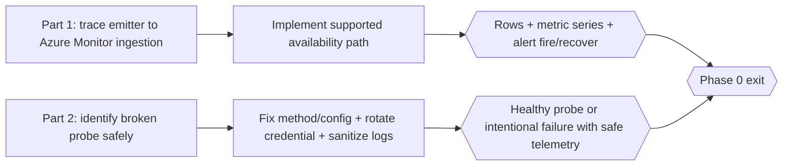

# Phase 0 — Restore Trustworthy SiteWatch Telemetry (Executable Plan)

This is the safety phase for the [Shared Telemetry Cost Optimisation specification](../telemetry-cost-optimisation-spec/README.md). It is intentionally lightweight because both parts require a stronger investigation agent with live Azure access and careful production validation.

The assigned agent needs read-only Azure Monitor/Resource Graph access, secret-safe incident investigation skills, owner coordination for credential rotation, and authority to use the repos' protected deployment workflows after the proposed remediation is reviewed.

**Do not start any Phase 1–4 deployment or any Phase 1–4 controlled-failure exercise until both Phase 0 parts pass.** Phase 0 deployments and controlled failures required by the two exit gates are permitted after the relevant remediation is reviewed and the test is confirmed non-customer-impacting. Part 2 may run in parallel with Part 1. Read-only inventory and source inspection for later phases may proceed while Phase 0 is open.

## What Phase 0 delivers

- **Part 1 — availability remediation** ([part-1-restore-availability.md](part-1-restore-availability.md)): identify why SiteWatch executions no longer create `AppAvailabilityResults`/availability metric series, implement the supported fix, and prove pass/fail/recovery through the existing alerts.
- **Part 2 — failing probe and sensitive logging remediation** ([part-2-remediate-failing-probe.md](part-2-remediate-failing-probe.md)): identify the `Invalid Task Method` probe without exposing its endpoint, correct the probe contract, rotate the potentially exposed credential, and eliminate secret-bearing URL/body logging.

## Golden rules

- Start with [evidence-and-safety.md](../telemetry-cost-optimisation-spec/evidence-and-safety.md). Do not reproduce raw URLs, query strings, tokens, or response bodies.
- Azure investigation is read-only until the root cause and proposed code/IaC change are documented. Deploy only through the owning repo's normal workflow.
- Keep all three SiteWatch regions and every source-defined/deployed alert in the reconciled inventory in this phase. Do not use the dated deployed count as the expected source count.
- A unit test proving `IAvailabilityTelemetry.Track()` was called is not sufficient. The exit gate requires deployed Azure Monitor evidence.
- Do not weaken alert thresholds or treat no-data as healthy to make the gate pass.
- If the fix belongs in `observability-opentelemetry`, finish and publish that package first, then stop at the NuGet boundary until Fraser provides/approves the version.
- No direct project references, copied shared types, or local package-feed bridges across repos.

## Definition of done

- Source-defined tests/planned alerts and deployed/enabled alerts are reconciled by check, destination, dimension, severity, and action group; every difference is intentional and recorded.
- Current successful and failed SiteWatch executions appear as structured availability results in each intended destination.
- `availabilityResults/availabilityPercentage` and `availabilityResults/count` return current series with the expected check-name dimension.
- Every distinct production destination/criterion/action-group route has safe notification evidence. Controlled pass-to-fail-to-recovery is recorded for non-customer synthetic routes; customer endpoints are not intentionally failed.
- Alert no-data behaviour is understood and, if required, explicitly remediated without hiding outages.
- The broken probe either succeeds with its intended safe method or is removed/disabled with an owner-approved reason.
- Any credential that may have appeared in telemetry is rotated through the secure owner process.
- No SiteWatch log contains an expanded URL query string, secret, or response body.
- Build, tests, format, Terraform checks (if touched), and `code-review` pass.

## Next

[Phase 1](../telemetry-cost-optimisation-phase-1/README.md) suppresses routine SiteWatch HTTP lifecycle traces after this safety gate is evidenced.