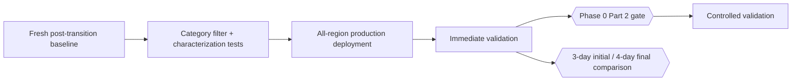

# Phase 1 — Suppress Routine SiteWatch HTTP Traces (Executable Plan)

Implement recommendation 1 from the [specification](../telemetry-cost-optimisation-spec/README.md): stop exporting successful `HttpClient` lifecycle chatter from SiteWatch while preserving structured availability and actionable failures.

> **Safety status:** Phase 0 Part 1 availability delivery is complete, but [Phase 0 Part 2](../telemetry-cost-optimisation-phase-0/part-2-remediate-failing-probe.md) remains open. The production deployment occurred while the governing Phase 0 gate still prohibited Phase 1 deployment. Phase advancement is halted: read-only validation and measurement may continue, but no further deployment, controlled-failure exercise, Part 2 exit, or later phase may proceed until Phase 0 Part 2 passes or the governing gate is formally changed with an approved rationale.

## What Phase 1 delivers

- **Part 1 — filter and tests** ([part-1-filter-and-tests.md](part-1-filter-and-tests.md)): establish the exact logger categories, apply a stable category/severity filter, and prove protected traces and dependency spans remain.
- **Part 1 implementation evidence** ([part-1-implementation-evidence.md](part-1-implementation-evidence.md)): sanitised baseline, category characterization, protected-signal evidence, implementation decision, and rollback.
- **Part 2 — production validation and measurement** ([part-2-rollout-and-measurement.md](part-2-rollout-and-measurement.md)): validate the all-region production deployment, verify alerting and failures, and measure complete-day ingestion reduction.
- **Part 2 implementation evidence** ([part-2-implementation-evidence.md](part-2-implementation-evidence.md)): production deployment, immediate safety checkpoints, controlled-signal evidence, and equal-window measurements.

## Locked implementation boundary

Start in `platform-sitewatch-func`. Filter the named client's framework logger category/prefix (for example the actual `System.Net.Http.HttpClient.SiteWatch.*` categories discovered by characterization) to `Warning` at the logging provider boundary. Do not disable `HttpClient` tracing: dependency spans are a separate performance/failure signal.

If the host cannot filter these categories before export, add the minimum stable category capability to `MX.Observability.OpenTelemetry`; this creates a package-first NuGet gate. Do not filter by the four English message strings unless category metadata is unavailable and the exception is explicitly justified.

## Definition of done

- The Phase 0 Part 2 safety gate passes, or an approved specification change formally reconciles the sequencing exception.
- The four routine successful lifecycle messages are absent from dev and production `AppTraces` after deployment.
- Retry warnings, terminal failures, exceptions, structured availability results, and dependency failure/latency spans remain.
- Every alert in the reconciled availability inventory retains current metric input.
- After Phase 0 Part 2 passes, a controlled non-customer dev failure fires and resolves without exposing sensitive telemetry.
- Equal-window measurement records GB/day before/after and protected-signal counts.
- No broad `Microsoft.* = Warning` rule suppresses unrelated Function host diagnostics.
- Build, tests, format, applicable Terraform checks, and `code-review` pass.

## Next

[Phase 2](../telemetry-cost-optimisation-phase-2/README.md) removes redundant derived metric series after their consumers are mapped.