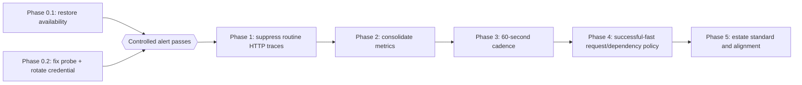

# Shared Telemetry Cost Optimisation — Specification

Reduce billable telemetry sent to the production `log-platform-monitoring-prd-uksouth` Log Analytics workspace while preserving the signals needed for alerting, audit, exception diagnosis, and performance monitoring. This folder records the evidence, target policy, safety rules, and delivery sequence. Step-by-step execution lives in the sibling phase folders.

## Why this work exists

The read-only 30-day baseline captured on 20 July 2026 showed approximately **51.8 GB** of billable ingestion. `AppTraces` contributed **31.6 GB (61%)**. Four routine SiteWatch `HttpClient` lifecycle messages accounted for **18.03 GB**, making source-side suppression of successful framework chatter the highest-confidence saving.

The same investigation found a safety issue that must be resolved first: SiteWatch traces continued after 17 July, but no SiteWatch availability rows were present in `AppAvailabilityResults`, and no availability metric series was returned from the Application Insights resources scoped by the enabled availability alerts. Cost changes must not proceed until structured availability delivery and alert firing are proven end to end.

All volumes are historical observations, not guaranteed future savings. The legacy SiteWatch pipeline changed during the baseline window, and the recommendations overlap. Each implementation phase therefore measures its own pre/post run rate rather than adding the headline estimates together.

## Documents

| Document                                         | Purpose                                                                                           |
| ------------------------------------------------ | ------------------------------------------------------------------------------------------------- |
| [evidence-and-safety.md](evidence-and-safety.md) | Sanitised baseline, known uncertainties, protected signals, and measurement method.               |
| [target-policy.md](target-policy.md)             | Target telemetry classes, retention rules, filtering/sampling boundaries, and rollout guardrails. |

## Locked decisions

| #   | Decision                | Choice                                                                                                                                                                                              |
| --- | ----------------------- | --------------------------------------------------------------------------------------------------------------------------------------------------------------------------------------------------- |
| 1   | Safety gate             | Restore SiteWatch structured availability and prove a controlled alert before any cost-reduction phase.                                                                                             |
| 2   | Filter location         | Prefer source-side logger/provider/filter configuration. Do not use workspace transformations as the first remedy.                                                                                  |
| 3   | Protected telemetry     | Retain 100% of audit/security events, exceptions, failed requests/dependencies, slow calls above the agreed threshold, structured availability results, and SiteWatch terminal failures/recoveries. |
| 4   | Routine traces          | Suppress successful SiteWatch `System.Net.Http.HttpClient.*` lifecycle logs below `Warning`; preserve retry warnings and terminal failures.                                                         |
| 5   | Metrics                 | Emit canonical observations and derive aggregates in Azure Monitor where practical; do not emit count/success/failure/rate/min/max/average variants without a named consumer.                       |
| 6   | Check topology          | Keep all three SiteWatch regions. After the signal is proven, move the check cadence from 30 seconds to a configurable 60-second production default.                                                |
| 7   | Requests/dependencies   | Filter only successful, fast traffic. Failures, retained status codes, and slow operations remain unsampled and queryable.                                                                          |
| 8   | Rollout                 | Pilot changes in dev, then one production application or SiteWatch region where routing permits. Compare equal complete-day windows and keep a configuration rollback.                              |
| 9   | Shared policy           | `observability-opentelemetry` and `observability-appinsights` remain the implementation owners for common filtering. App repos supply documented overrides rather than bespoke processors.          |
| 10  | Credentials             | Never log expanded probe URLs, query strings, tokens, response bodies, or secrets. Rotate any credential that may have appeared in telemetry.                                                       |
| 11  | Cost estimates          | Treat phase estimates as non-additive. Record measured GB/day and retained-signal checks at each exit gate.                                                                                         |
| 12  | Workspace configuration | Workspace/table retention changes and commitment-tier changes are out of scope for this package.                                                                                                    |

## Delivery phases

| Phase | Recommendation mapping                 | Delivers                                                                                                                                                                                                              | Folder                                                                                   |
| ----- | -------------------------------------- | --------------------------------------------------------------------------------------------------------------------------------------------------------------------------------------------------------------------- | ---------------------------------------------------------------------------------------- |
| 0     | Safety prerequisite + recommendation 2 | Part 1 restores SiteWatch availability delivery and proves alerting; Part 2 fixes the failing probe and credential-bearing logging path. Investigation is intentionally lightweight and assigned to a stronger agent. | [telemetry-cost-optimisation-phase-0/](../telemetry-cost-optimisation-phase-0/README.md) |
| 1     | Recommendation 1                       | Suppress routine SiteWatch HTTP lifecycle traces while retaining retry, terminal failure, recovery, exception, and availability evidence.                                                                             | [telemetry-cost-optimisation-phase-1/](../telemetry-cost-optimisation-phase-1/README.md) |
| 2     | Recommendation 3                       | Map metric consumers, remove redundant derived series, and keep the minimum canonical metric/availability contract.                                                                                                   | [telemetry-cost-optimisation-phase-2/](../telemetry-cost-optimisation-phase-2/README.md) |
| 3     | Recommendation 4                       | Make SiteWatch cadence configurable and roll production from 30 seconds to 60 seconds without reducing regional coverage.                                                                                             | [telemetry-cost-optimisation-phase-3/](../telemetry-cost-optimisation-phase-3/README.md) |
| 4     | Recommendation 5                       | Pilot and roll out successful-fast request/dependency filtering across connected applications, with per-app thresholds and exclusions.                                                                                | [telemetry-cost-optimisation-phase-4/](../telemetry-cost-optimisation-phase-4/README.md) |
| 5     | Recommendation 6                       | Codify the estate telemetry policy in shared packages, org guidance, templates, and compliance checks; align remaining applications.                                                                                  | [telemetry-cost-optimisation-phase-5/](../telemetry-cost-optimisation-phase-5/README.md) |

Phases 1–3 are sequential because they affect the same SiteWatch volume and their savings overlap. Phase 4 may begin after the Phase 0 safety gate, but use a separate baseline and do not combine its savings estimate with SiteWatch until both have stable complete-day measurements. Phase 5 follows the pilots so the standard records proven defaults rather than assumptions.

## Programme definition of done

- Every alert in the reconciled production availability inventory has a proven live data source; each distinct criterion/destination/action-group route has safe notification evidence, with controlled pass-to-fail-to-recovery recorded where a non-customer synthetic check permits it.
- SiteWatch no longer exports routine successful HTTP lifecycle traces at `Information`, while retries, terminal failures, recoveries, exceptions, and availability remain visible.
- Every retained custom metric series has a named alert, workbook, dashboard, SLO, or troubleshooting consumer.
- SiteWatch runs at a configurable 60-second production cadence across all three regions.
- Connected applications use the shared successful-fast request/dependency filtering policy or record an approved exception.
- Audit/security events, exceptions, failures, and slow operations remain at 100% retention through the application telemetry pipeline.
- Each phase records equal-window pre/post ingestion, signal-preservation checks, rollback evidence, and any uncertainty.
- Every touched .NET repo passes build, tests, and `dotnet format --verify-no-changes`; Terraform repos pass `terraform fmt -check` and validation/plan where infrastructure changes.
- The `code-review` sub-agent reports no unresolved High or Medium findings before each implementation PR is declared ready.